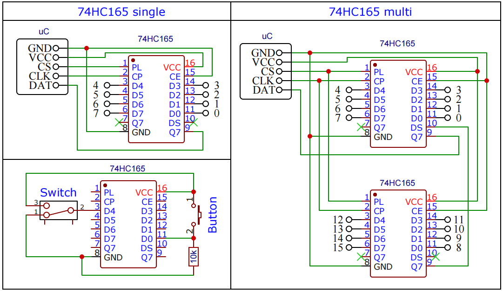

[](https://github.com/GyverLibs/GyverShift/releases/latest/download/GyverShift.zip)
[](https://registry.platformio.org/libraries/gyverlibs/GyverShift)
[](https://www.ardu-badge.com/GyverShift)
[](https://alexgyver.ru/)
[](https://alexgyver.ru/support_alex/)
[](https://github-com.translate.goog/GyverLibs/GyverShift?_x_tr_sl=ru&_x_tr_tl=en)  

[](https://t.me/GyverLibs)

# GyverShift
Библиотека для удобной работы со сдвиговыми регистрами, увеличение количества пинов Arduino
- На выход - 74HC595
- На вход - 74HC165
- Буферизация значений побитно в буфер
- Быстрая bit-bang передача данных на базе GyverIO - в десятки раз быстрее стандартных shift-функций
- Работа через аппаратный SPI
- Удобное обращение к пинам как к массиву

### Совместимость
Совместима со всеми Arduino платформами (используются Arduino-функции)

## Содержание
- [Подключение](#wiring)
- [Использование](#usage)
- [Пример](#example)
- [Версии](#versions)
- [Установка](#install)
- [Баги и обратная связь](#feedback)

<a id="wiring"></a>

## Подключение
### 74HC595


### 74HC165


> Примечание: пин должен быть либо подтянут, либо иметь однозначный сигнал LOW/HIGH

### Онлайн пример
  

Совмещённый пример (165 на вход управляет 595 на выход) можно потыкать [на wokwi](https://wokwi.com/projects/385985356026270721)

<a id="usage"></a>
## Использование

### Инициализация
```cpp
// bit-bang (любые пины)
#include <GyverShift.h>
GyverShift<OUTPUT, кол-во чипов> reg(CS, DAT, CLK); // выход (HC595)
GyverShift<INPUT, кол-во чипов> reg(CS, DAT, CLK);  // вход (HC165)

// bit-bang (любые пины) - пины в шаблоне (более высокая скорость передачи на AVR)
#include <GyverShiftT.h>
GyverShiftT<OUTPUT, кол-во чипов, CS, DAT, CLK> reg; // выход (HC595)
GyverShiftT<INPUT, кол-во чипов, CS, DAT, CLK> reg;  // вход (HC165)

// аппаратный SPI
#include <GyverShiftSPI.h>
GyverShiftSPI<OUTPUT, кол-во чипов, clock = 4000000> reg(CS); // выход (HC595)
GyverShiftSPI<INPUT, кол-во чипов, clock = 4000000> reg(CS);  // вход (HC165)

// пины SPI
// OUTPUT: DAT->MOSI
// INPUT: DAT->MISO
```

> Примечание: для режима `INPUT` (74HC165) **аппаратный SPI** работает некорректно из за особенностей чипа - не читает последний (D7) вход!

### Описание класса
```cpp
// ===============================
// обновить состояния пинов. Вернёт true, если было изменение буфера (для режима INPUT)
bool update();

// true - было изменение буфера (для режима INPUT). Само сбросится в false
bool changed();

// доступ к буферу
uint8_t buffer[];

// ===============================
// наследуется из BitPack
void set(uint16_t num);                 // установить
void clear(uint16_t num);               // сбросить
void toggle(uint16_t num);              // переключить
void write(uint16_t num, bool state);   // записать
bool read(uint16_t num);                // прочитать
void setAll();                          // установить все
void clearAll();                        // сбросить все
uint16_t amount();                      // количество пинов
uint16_t size();                        // размер в байтах

// ===============================
// дефайны настроек (вызывать перед подключением библиотеки)
#define GSHIFT_DELAY 5      // установить задержку bitbang (снизить скорость передачи), микросекунды
#define GSHIFTSPI_DELAY 5   // установить задержку bitbang пина CS, микросекунды
```

### Чтение-запись
Библиотека наследует [BitPack](https://github.com/GyverLibs/BitPack) - доступ к буферу как к массиву и прочие инструменты. Буфер побитовый и упакован в байты, чип как раз имеет 8 входов-выходов. Для обновления состояния выходов и чтения входов нужно вызвать `update()`.
```cpp
// OUTPUT
reg[0] = 1;       // включить пин 0
reg[1] = 0;       // выключить пин 1
reg.write(2, 1);  // включить пин 2
reg.set(3);       // включить пин 3
reg.clear(4);     // выключить пин 4
//reg.setAll();   // включить все
reg.update();     // обновить состояния пинов


// INPUT
reg.update();     // прочитать пины
// получить из буфера любым способом
Serial.println(reg[0]);
Serial.println(reg.read(1));
bool p2 = reg[2];
bool p3 = reg.read(3);
```

<a id="example"></a>
## Пример
Остальные примеры смотри в **examples**!

```cpp
#include <GyverShift.h>
// 74hc595
#define CLK_595 13
#define CS_595 9
#define DAT_595 11

GyverShift<OUTPUT, 2> outp(CS_595, DAT_595, CLK_595);
void setup() {
    outp.write(0, 1);
    outp.write(1, 1);
    outp[7] = 1;
    outp[8] = 1;
    outp[14] = 1;
    outp.update();
}
```

<a id="versions"></a>

## Версии
- v1.0
- v1.1 - добавлен класс GyverShiftT с пинами в шаблоне

<a id="install"></a>
## Установка
- Для работы требуются библиотеки [BitPack](https://github.com/GyverLibs/BitPack) и [GyverIO](https://github.com/GyverLibs/GyverIO)
- Библиотеку можно найти по названию **GyverShift** и установить через менеджер библиотек в:
    - Arduino IDE
    - Arduino IDE v2
    - PlatformIO
- [Скачать библиотеку](https://github.com/GyverLibs/GyverShift/archive/refs/heads/main.zip) .zip архивом для ручной установки:
    - Распаковать и положить в *C:\Program Files (x86)\Arduino\libraries* (Windows x64)
    - Распаковать и положить в *C:\Program Files\Arduino\libraries* (Windows x32)
    - Распаковать и положить в *Документы/Arduino/libraries/*
    - (Arduino IDE) автоматическая установка из .zip: *Скетч/Подключить библиотеку/Добавить .ZIP библиотеку…* и указать скачанный архив
- Читай более подробную инструкцию по установке библиотек [здесь](https://alexgyver.ru/arduino-first/#%D0%A3%D1%81%D1%82%D0%B0%D0%BD%D0%BE%D0%B2%D0%BA%D0%B0_%D0%B1%D0%B8%D0%B1%D0%BB%D0%B8%D0%BE%D1%82%D0%B5%D0%BA)
### Обновление
- Рекомендую всегда обновлять библиотеку: в новых версиях исправляются ошибки и баги, а также проводится оптимизация и добавляются новые фичи
- Через менеджер библиотек IDE: найти библиотеку как при установке и нажать "Обновить"
- Вручную: **удалить папку со старой версией**, а затем положить на её место новую. "Замену" делать нельзя: иногда в новых версиях удаляются файлы, которые останутся при замене и могут привести к ошибкам!

<a id="feedback"></a>
## Баги и обратная связь
При нахождении багов создавайте **Issue**, а лучше сразу пишите на почту [alex@alexgyver.ru](mailto:alex@alexgyver.ru)  
Библиотека открыта для доработки и ваших **Pull Request**'ов!

При сообщении о багах или некорректной работе библиотеки нужно обязательно указывать:
- Версия библиотеки
- Какой используется МК
- Версия SDK (для ESP)
- Версия Arduino IDE
- Корректно ли работают ли встроенные примеры, в которых используются функции и конструкции, приводящие к багу в вашем коде
- Какой код загружался, какая работа от него ожидалась и как он работает в реальности
- В идеале приложить минимальный код, в котором наблюдается баг. Не полотно из тысячи строк, а минимальный код
